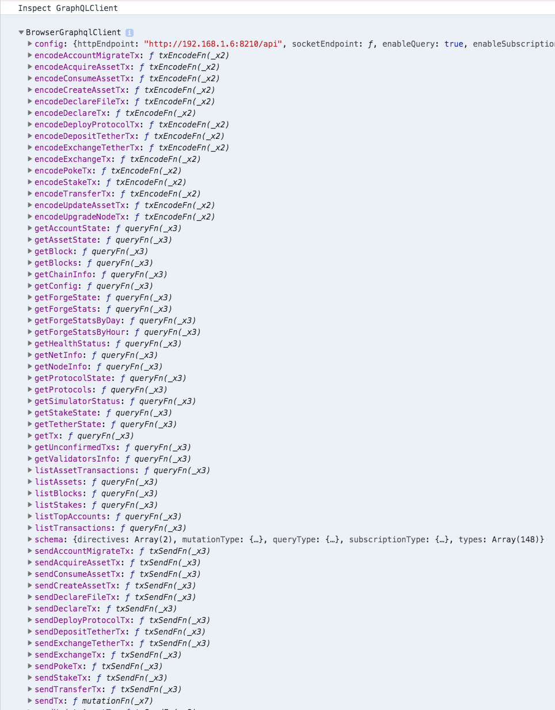

[](https://app.netlify.com/sites/forge-next-starter/deploys)

> Brings tons of thousands react libraries/components to dApps that run on [forge](https://www.arcblock.io/en/forge-sdk) powered blockchain.

[Live preview](https://forge-keystone-starter.netlify.com/)


A starter project that integrates [forge](https://docs.arcblock.io/forge/latest/) [javascript sdk](https://docs.arcblock.io/forge/latest/sdk/javascript.html) with mainstream javascript application batteries:

- [Keystone.js](https://keystonejs.org/) for serving admin ui
- [Next.js](https://nextjs.org/) for crafting pages and SSR
- [Material-UI](https://material-ui.com/) for resuable react components
- [Express.js](http://expressjs.com/) as custom web server that can serve custom api
- [Mongoose](https://mongoosejs.com/) as database ORM layer

Forge SDK libraries included in the starter project:

- [@arcblock/graphql-client](https://www.npmjs.com/package/@arcblock/graphql-client) as communication layer between application and forge powered blockchain
- [@arcblock/did-auth](https://www.npmjs.com/package/@arcblock/did-auth) help application do jwt based auth with ABT wallet
- [@arcblock/did-auth-storage-mongo](https://www.npmjs.com/package/@arcblock/did-auth-storage-mongo) storage engines that powers the magic behind ABT Wallet qrcode scanning
- [@arcblock/did-react](https://www.npmjs.com/package/@arcblock/did-react) react components that can implements basic UI elements to connect your application with ABT Wallet, such as avatar and auth dialog

Other javascript project goodies:

- `jwt`: token based authentication
- `eslint`: for consistent coding style
- `prettier`: for consistent code formatting
- `husky`: and `lint-staged` for prepush and precommit hooks
- `nodemon`: for auto restart server on node.js code change
- `next.js`: supports hot reload on client code change
- `dotenv`: to load configurations from `.env` files

## Folder Structure

```terminal
.
├── LICENSE
├── Makefile
├── README.md
├── app.js                    // application entry file
├── client                    // code for client side pages
│   ├── babel.config.js       // custom babel configuration
│   ├── components            // shared react components/layouts across all pages
│   ├── hooks                 // shared react hooks
│   ├── libs                  // shared utility code
│   ├── next.config.js        // custom next.js configuration
│   ├── pages                 // pages
│   └── static                // static assets that can be loaded by browser
├── package.json
├── server                    // backend code
│   ├── libs                  // shared server libs
│   ├── models                // mongoose db models
│   └── routes                // express routes and handlers
├── version
└── yarn.lock
```

## Runtime Requirements

- Mongodb v3+
- Node.js v10+
- That's all

## Usage

### Create new project with forge-cli

```terminal
# [Optional] setup a chain node by forge
npm install -g @arcblock/forge-cli forge-keystone-starter
forge install
forge start

# create a dApp
forge blocklet:use forge-keystone-starter --target hello-forge
cd hello-forge
npm start
```

### Just use this starter repo

> **Note: You have to setup an `.env` file manually.**

```terminal
git clone https://github.com/ArcBlock/forge-dapp-starters.git
cd forge-dapp-starters/packages/forge-keystone-starter/templates
npm install
npm start
```

## Configuration

dApp configuration file is auto generated and stored in `.env`, example configure as:

```text
# server only
MONGO_URI="mongodb://localhost/forge-next-starter"
COOKIE_SECRET="you_should_change_this"
APP_TOKEN_SECRET="you_should_change_this"
APP_TOKEN_TTL="1d"
APP_SK="0x95d4ef0af090e1cf21b9fd0ccefe768a7bff660375b0bfdb95a34a4106a68bf7f7995a7066cd1171b4e963f2b36de17eb642c4145d58733cfa9b03a11bb5f11e"
APP_PORT=3030

# both server and client
CHAIN_ID="zinc-2019-05-17"
CHAIN_HOST="https://zinc.abtnetwork.io/api"
APP_ID="zNKrVwYxwgsYAUX3mGjK42oNuePLVT3Me6ga"
APP_NAME="Forge Keystone.js Starter"
BASE_URL="http://10.113.10.82:3030"
API_PREFIX=""
```

> Caution: `.env` contains very sensitive info such as Application wallet secret key, PLEASE DO NOT COMMIT `.env` FILE

## FAQ

### How to upgrade `@arcblock/*` dependencies?

Simple, just update `package.json`, then `yarn`, be sure to test the starter after upgrading.

### How to deploy my application?

Checkout [Deployment.md](./docs/deployment.md)

### What APIs are supported by `GraphQLClient`?

Checkout the following screenshot or just run the starter and open browser console.



## LICENSE

Copyright 2018-2019 ArcBlock

Licensed under the Apache License, Version 2.0 (the "License");
you may not use this file except in compliance with the License.
You may obtain a copy of the License at

    http://www.apache.org/licenses/LICENSE-2.0

Unless required by applicable law or agreed to in writing, software
distributed under the License is distributed on an "AS IS" BASIS,
WITHOUT WARRANTIES OR CONDITIONS OF ANY KIND, either express or implied.
See the License for the specific language governing permissions and
limitations under the License.
