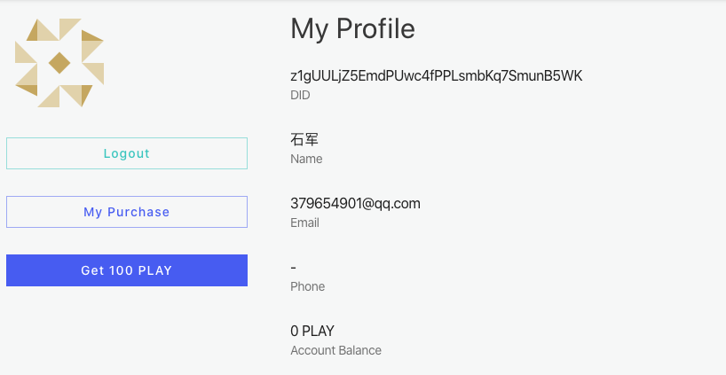

@include ../fragments/shared.md

## Why Build on ArcBlock {.section .section--inverted .section--image-feature-list bgColor="#2F3036"}

We've built a production-ready platform that includes everything developers need to build, run and use DApps.

!ActionButton[BUILD YOURS NOW](https://blocklet.arcblock.io/blocklets/starter/xmark-currency-starter)

!ActionButton[VISIT ARCBLOCK SDK](https://www.arcblock.io/en/forge-sdk)

#### Developer Ready

ArcBlock’s free SDK includes everything you need to build and run your app.

#### Decentralized Identity

W3C compliant [specification](https://arcblock.github.io/abt-did-spec/) and industry leading identity wallet for users.

#### Production Grade

Build for scale, interoperability and security using the [ABT Network](https://www.abtnetwork.io).
## Profile Page {.section .section--image-row columnSize="6:6"}

Check your account balance with our `@arcblock/forge-sdk`.

!ActionButton[Profile Example](/profile){}

## Payment Page {.section .section--image-row .section--reversed columnSize="6:6"}

Simple paid content with `@arcblock/did-rect` and `@arcblock/forge-sdk`.

!ActionButton[Payment Example](/payment){}

## Forge XMark Starter {.section .section--hero .section--image-row}

Using markdown to write static pages, using react to build dynamic pages.

!ActionButton[Application State](/application){}
 

!ActionButton[Transaction/Block](/blocks){}
 
