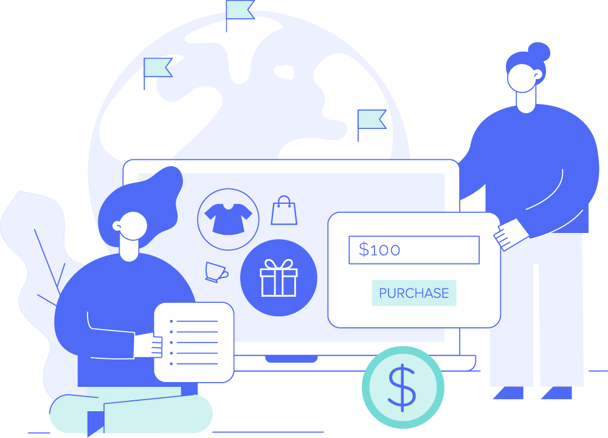
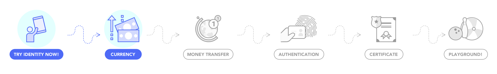
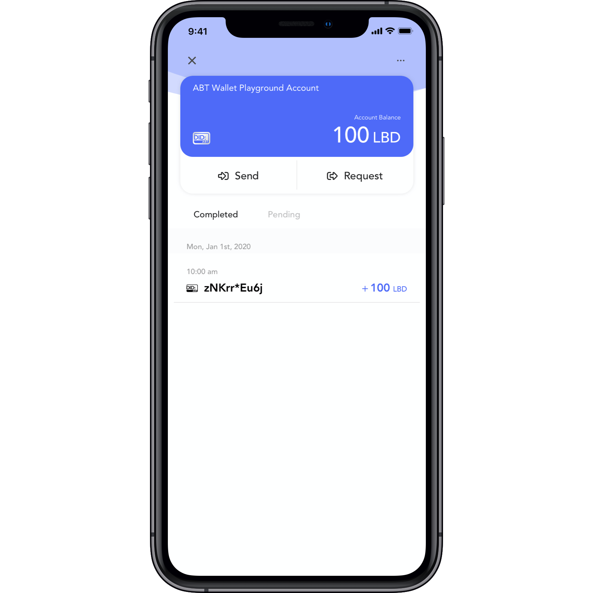
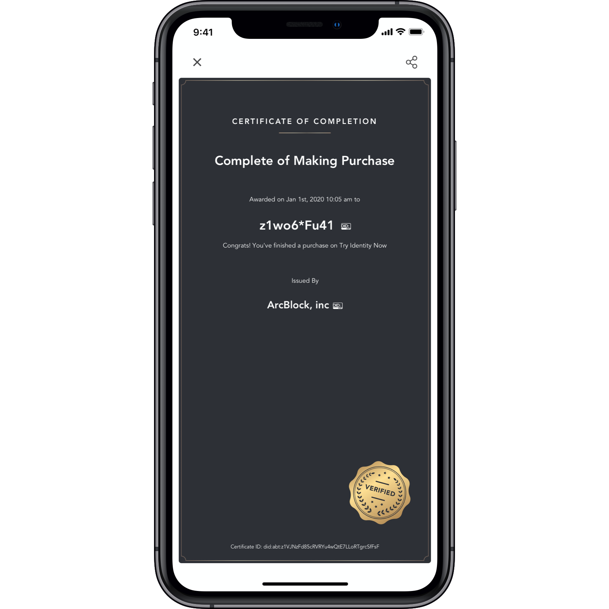
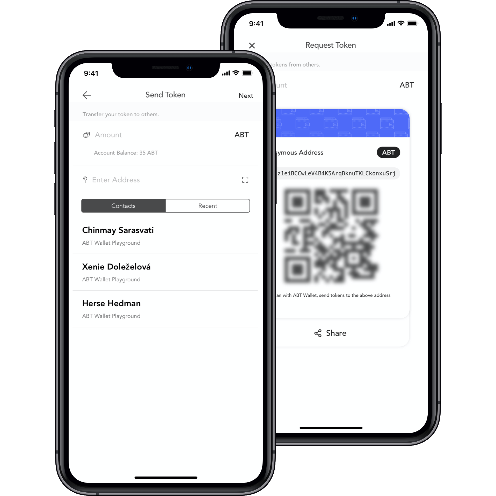
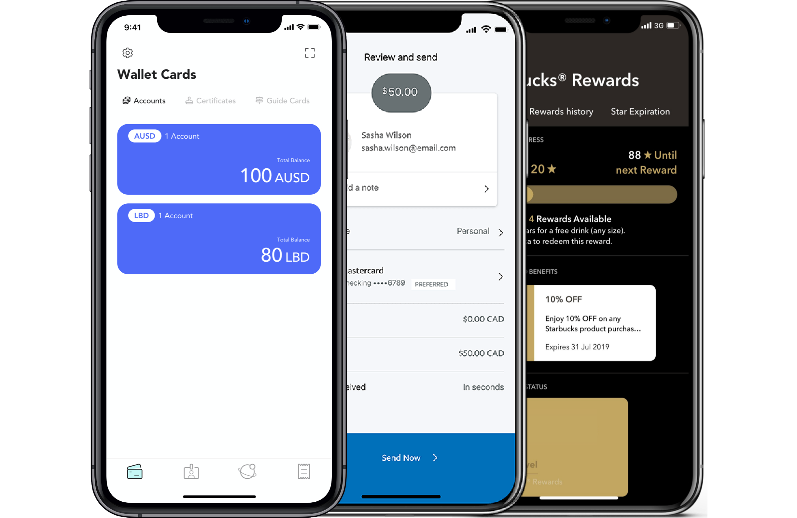
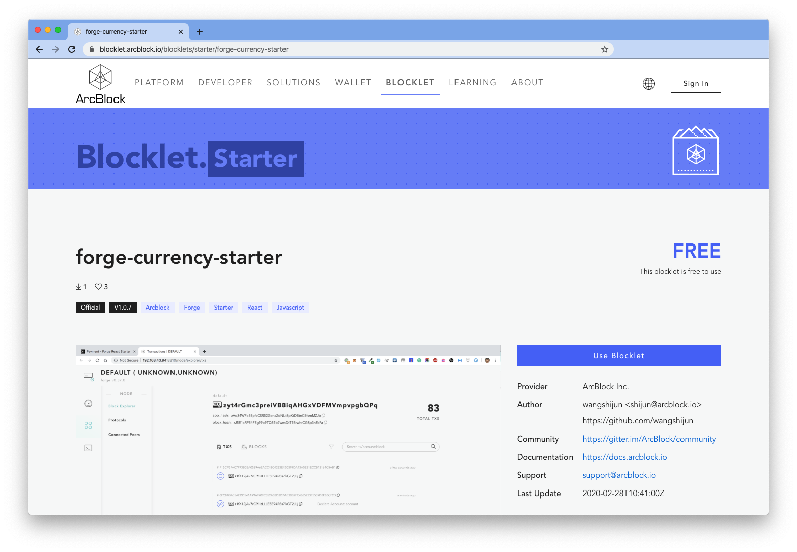

@include ./fragments/shared.md

## Wallet With Digital Cash {.section .section--image-row-background paddingTop="120px" paddingBottom="260px" bgColor="FAFAFA"}

!Badge[Demonstration App]

<b>
- Setup Your Identity Wallet 
- Add Money (LBD) 
- Make A Purchase 
- Transfer Money  
</b>

!ActionButton[DOWNLOAD IOS](https://itunes.apple.com/app/id1460083542){icon="fab fa-apple"}
!ActionButton[DOWNLOAD ANDROID](https://play.google.com/store/apps/details?id=com.arcblock.wallet.app.product){icon="fab fa-google-play"}

## Use Decentralized Identity to Manage Currency {.section .section--image-row columnSize="6:6" .section--centered .section--inverted bgColor="#2F3036"}

In this demo, you can use Decentralized Identity to manage your digital money. Because it’s on the blockchain, it’s easy to verify activity and give users complete control of their identity.

## {.section .section--row .section--centered paddingTop="20px" paddingBottom="20px"}

## Setup Your Identity Wallet {.section .section--image-row columnSize="6:6" .section--centered}

To start, setup and create your first account card. Now register below. Note, we don't store your data and you confirm everything you share.

!PlaygroundAction[login]{title="REGISTER ACCOUNT" buttonColor="primary" successMessage="Thanks For Registering (%user.name%)"}

## Add Money {.section .section--image-row columnSize="6:6" .section--centered}

Use the button below and scan the QR Code to add LBD, confirm the request and verify your deposit. Great work. Those funds are instantly ready in your wallet.

!PlaygroundAction[receive_local_token]{title="GET 100 LBD" buttonColor="primary" amount=100}

## Make A Purchase {.section .section--image-row columnSize="6:6" .section--centered}

It’s very easy to make a payment for a digital asset, using blockchain and smart contracts buyers, sellers and users can exchange assets easily.

!PlaygroundAction[buy_local_certificate_with_local_token]{title="BUY A DIGITAL ASSET FOR 20 LBD" buttonColor="primary" payAmount=20 name="Complete of Making Purchase" description="Congrats! You've finished a purchase on Try Identity Now"}

## Transfer Money {.section .section--image-row columnSize="6:6" .section--centered}

It's also easy to share your currency with someone else. Using their address, and you can transfer currency instantly.

## Anything is Possible {.section .section--image-row columnSize="6:6" .section--centered}

Just like Paypal and Venmo, but without the cost, build your own Cash App to support a secure currency, crypto payments, prepaid accounts, loyalty points and more.

## Now, Build It Yourself {.section .section--image-row columnSize="6:6" .section--inverted .section--centered bgColor="#4e6af6"}

In just a few minutes, you can build your own Cash App experience. ArcBlock makes it easy for anyone to develop applications including your own Cash App. The Currency Blocklet is a full-stack javascript DApp template with ArcBlock's SDK fully integrated. Try it now!

!ActionButton[DEPLOY NOW](https://blocklet.arcblock.io/blocklets/starter/forge-currency-starter){theme="default"}

## Why Build on ArcBlock {.section .section--inverted .section--image-feature-list bgColor="#2F3036"}

We've built a production-ready platform that includes everything developers need to build, run and use DApps.

!ActionButton[BUILD YOURS NOW](https://blocklet.arcblock.io/blocklets/starter/forge-currency-starter)
!ActionButton[VISIT FORGE SDK](https://www.arcblock.io/en/forge-sdk)

#### Developer Ready

ArcBlock’s free SDK includes everything you need to build and run your app.

#### Decentralized Identity

W3C compliant [specification](https://arcblock.github.io/abt-did-spec/) and industry leading identity wallet for users.

#### Production Grade

Build for scale, interoperability and security using the [ABT Network](https://www.abtnetwork.io).

## Get Help With Your Project {.section .section--centered}

!ContactForm{formId="f264a8ef-3354-48f1-9863-42a894602204" title=" " button="CONTACT US" fields="Company,Email,First Name,Last Name" successMessage="Thank you for your submission!"}
