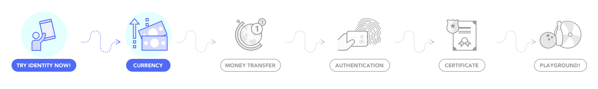
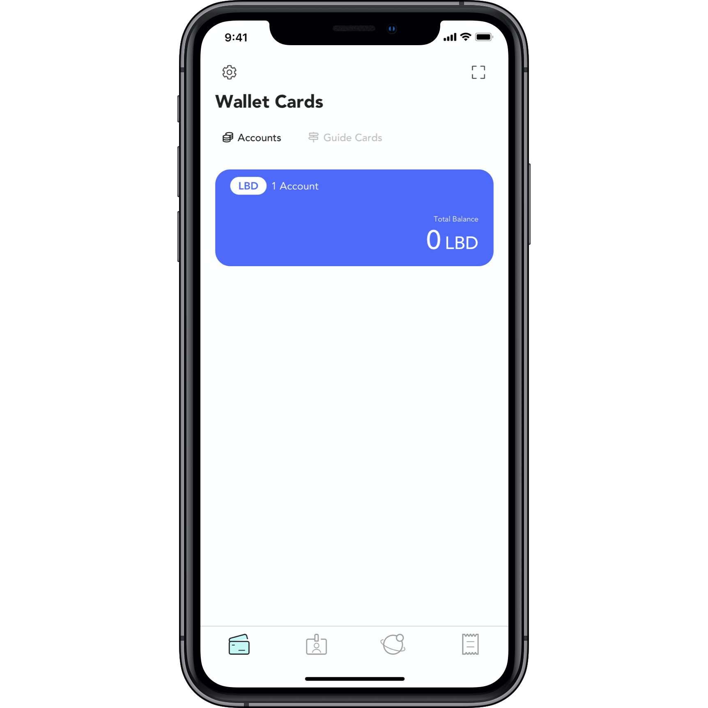
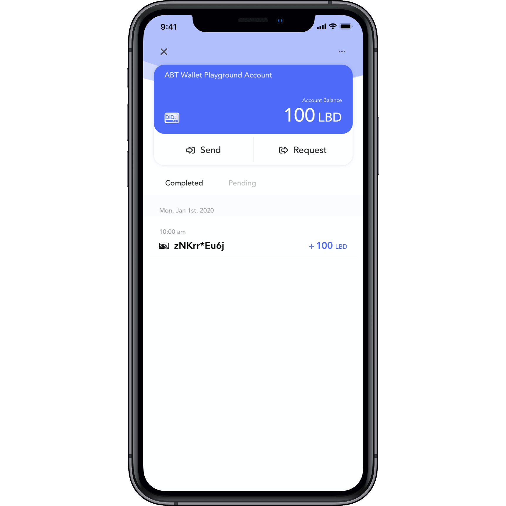
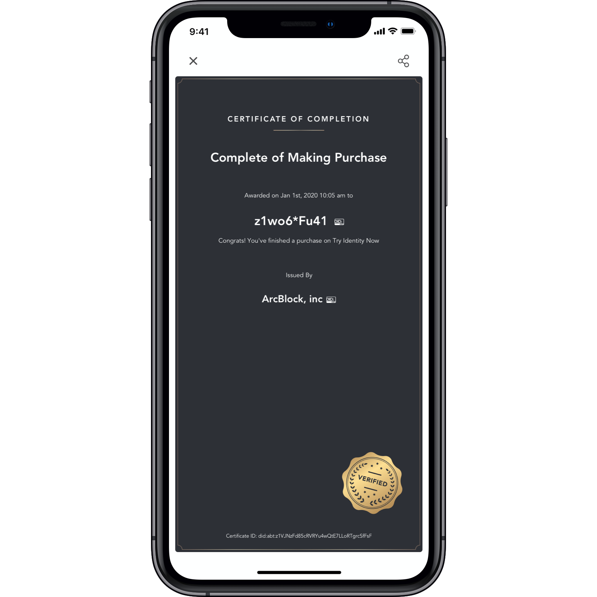
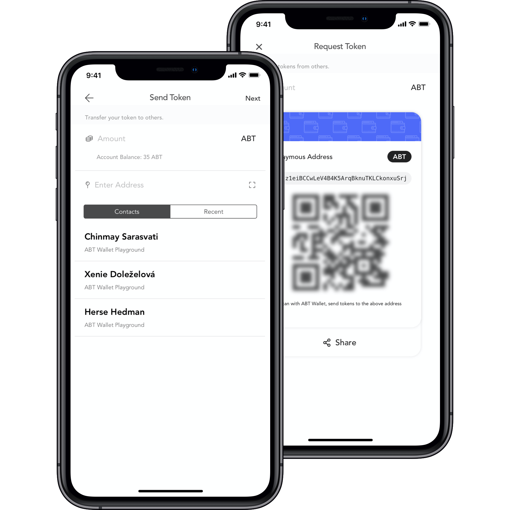
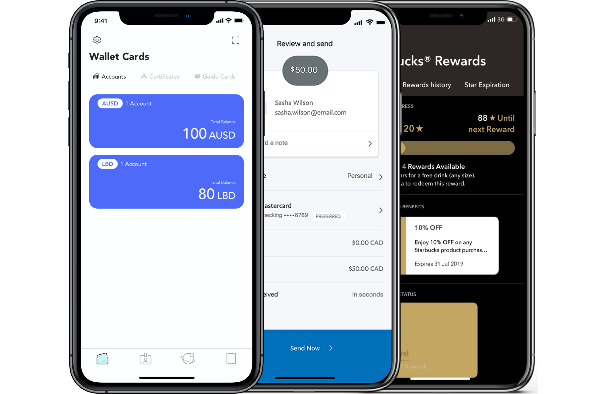

@include ./fragments/shared.zh.md

## 一个现金应用示例 {.section .section--image-row-background paddingTop="120px" paddingBottom="260px" bgColor="FAFAFA"}

!Badge[示例应用]

让我们面对现实：没有人想再随身携带现金了，信用卡也不像我们想象的那样安全。去中心身份和区块链的绝佳用例之一是货币。  我们创建这一示例让你体会去中心身份、区块链和货币如何工作。现在下载ABT钱包，开始体验。

!ActionButton[下载 IOS](https://itunes.apple.com/app/id1460083542){icon="fab fa-apple"}
!ActionButton[下载 安卓](https://play.google.com/store/apps/details?id=com.arcblock.wallet.app.product){icon="fab fa-google-play"}

## 使用去中心身份管理货币 {.section .section--row .section--centered}

在此示例中，你可以使用去中心身份来管理你的数字货币。因为有了区块链的支持，用户可以轻松验证和掌控他们的活动和身份。

## 设置你的钱包和账户 {.section .section--image-row columnSize="5:7" .section--centered}

现在开始，设置你的钱包并创建第一个账户卡。 使用下面的按钮注册。注意：我们不会存储你的数据，并由你确认每一个你分享的信息。

!PlaygroundAction[login]{title="注册账户" buttonColor="primary" successMessage="感谢注册，(%user.name%)!"}

## 获得货币 {.section .section--image-row columnSize="5:7" .section--centered}

使用下面按钮来扫描二维码来获得LBD，确认请求并验证你的账户。 很快，这些 LBD 就会添加到你的钱包中了！

!PlaygroundAction[receive_local_token]{title="获得 100 LBD" buttonColor="primary" amount=100}

## 完成一项购买活动 {.section .section--image-row columnSize="5:7" .section--centered}

为一项数字资产进行支付，非常容易！ 使用区块链和智能合约，买家、卖家和用户可以轻松交易资产。

!PlaygroundAction[buy_local_certificate_with_local_token]{title="购买资产：20 LBD" buttonColor="primary" payAmount=20 name="购买完成" description="恭喜！你在 Try Identity Now 完成购买"}

## 完成转账 {.section .section--image-row columnSize="5:7" .section--centered}

把你的货币转账给他人也是非常容易的。通过他们的钱包地址，你可以完成即时转账。

## 探索无限可能 {.section .section--image-row columnSize="5:7" .section--centered}

就像 Paypal 和 Venmo 一样，但无需耗费巨资，你可以创建自己的”现金应用“来支持安全的货币、加密支付、预付账户、积分计划等。

## 自己动手，即刻创建 {.section .section--image-row columnSize="5:7" .section--inverted .section--centered bgColor="#4e6af6"}

只需几分钟，即可创建你自己的”现金应用“。ArcBlock 让任何人都能轻松开发去中心化应用。货币 Blocklet 是完全集成 ArcBlock SDK 的全栈 javascript DApp 模板。现在就尝试！

!ActionButton[现在部署](https://blocklet.arcblock.io/blocklets/starter/forge-currency-starter){theme="default"}

## 为何基于 ArcBlock 开发  {.section .section--inverted .section--image-feature-list bgColor="#2F3036"}

我们已经构建了一个具备生产环境平台，包括开发者构建运行和使用 DApp 所需的一切。

!ActionButton[现在开始开发](https://blocklet.arcblock.io/blocklets/starter/forge-currency-starter)
!ActionButton[查看 SDK](https://www.arcblock.io/zh/forge-sdk)

#### 开发者友好

包含一切开发和运行应用所需的 ArcBlock SDK

#### 去中心身份

兼容 W3C [标准](https://arcblock.github.io/abt-did-spec/)，业界领先的去中心身份钱包

#### 生产级别环境

基于 [ABT 链网](https://www.abtnetwork.io) 为可扩展性、互通性和安全性而生

## 为你的项目获取帮助 {.section .section--centered}

!ContactForm{formId="f264a8ef-3354-48f1-9863-42a894602204" title=" " button="联系我们" fields="公司名称,电子邮箱,姓氏,名字" successMessage="感谢您的咨询！"}
