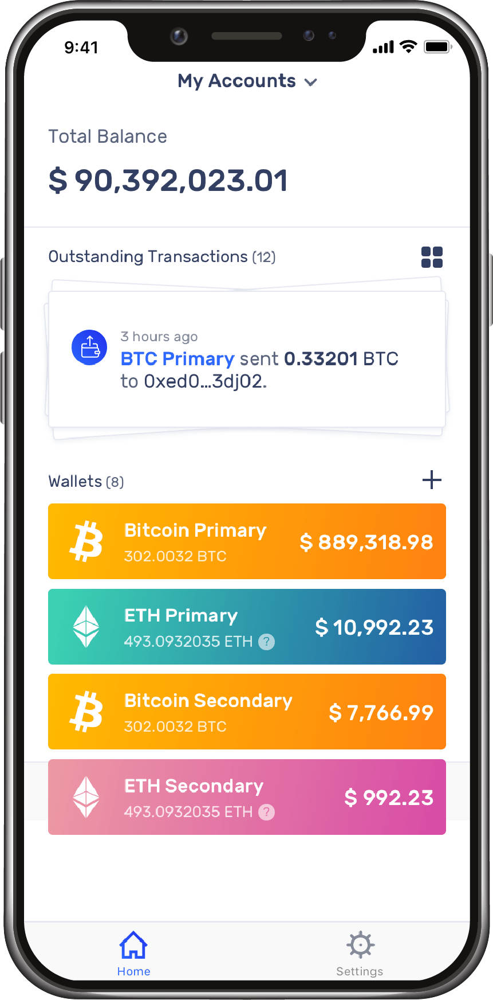

## Hero section from top to bottom. {.section .section--hero .section--image-background .section--inverted bgColor="#86995E" paddingTop="200px" paddingBottom="400px"}

A fully decentralized wallet that put you in control of everything - digital identity, tokens, profiles and more.

[Demo App](mailto:mining-partner@arcblock.io){.action-button}
[Install](mailto:mining-partner@arcblock.io){.action-button}


## {.section .section--footnotes .section--inverted}

#### A Blockchain 3.0 Platform that put you in control of everything


#### A Blockchain 3.0 Platform that makes it super easy to developer dapps


#### A Blockchain 3.0 Platform that makes it super cheap to run dapps


## Hero section from left to right {.section .section--hero .section--image-row columnSize="7:5" paddingBottom="200px"}

A new app that make Token management and accounting easy. Now you've got help to manage your entire token portfolio, transactions and history with meaningful personalized insight.

!ActionButton[Download iOS](https://www.arcblock.io){icon="fab fa-apple" color="#ffffff" gradient="linear-gradient(260deg,#212feb,#2952f7 62%,#2d68ff)"}
!ActionButton[Download Android](https://www.arcblock.io){icon="fab fa-google-play" color="#ffffff" gradient="linear-gradient(258deg,#33c3aa,#70e679)"}



## Section with background gradient and image {.section .section--image-row .section--inverted .section--reversed .section--centered bgGradient="linear-gradient(72deg, #ffca56, #ff9e4a)"}


## Feature List with Images {.section .section--image-feature-list .section--centered}

You are only limited by your imagination. ABT Node is a browser-enabled framework that gives you everything you need to deploy and manage your DApps. It’s flexible, secure, and completely decentralized.

#### Connect Your Networks


Run on your local network, or onnect to other networks in a single click, and easily manage all your nodes and networks in a single place.

#### Use the Marketplace


Don’t want to build a DApp? Use the marketplace to install a Blocklet and start running your own decentralized blogs, sites, stores and more.

#### Data Ownership


Don’t want to build a DApp? Use the marketplace to install a Blocklet and start running your own decentralized blogs, sites, stores and more.

#### {.section-action-button}

[Getting Started](mailto:mining-partner@arcblock.io){.action-button}

## Step Guide {.section .section--step-guide}

Deploy your DApp in seconds, Choose how you want to deploy your ABT Node - run it locally, in the cloud or connect to another network - and customize from there.

#### Step 1

##### Download or Deploy Your ABT Node

Download and run your ABT Node locally, or start running an ABT Node in the cloud.

#### Step 2

##### Connect and Authenticate

Verify your decentralized ID using the ABT Wallet and secure your node. No longer do you need to rely on 3rd parties, use the ABT Wallet to confirm who you are and who your users are.

#### Step 3

##### Start running your node

Install your DApp, find a Blocklet from the marketplace, or connect to another network with an invite code. It’s as simple as that.

#### Step 4

##### Start running your node

Install your DApp, find a Blocklet from the marketplace, or connect to another network with an invite code. It’s as simple as that.


## Horizontal Annotation List {.section .section--horizontal-annotation-list}

Register your decentralized wallet on ABTNet to get full access to the entire ArcBlock ecosystem

#### Cards

Make and receive payments, manage your connections, share your details, send and receive gift cards with a single click.

#### Contacts & more

Add your digital assets, send and receive with a single click, manage your activity, and more.


#### Profiles

Signup and set up your wallet. Begin accessing DApps and ABT services immediately. You own everything and its all completely decentralized.

#### Notifications

Find out who wants to see your data and manage what data you are willing to share. Get notified everytime someone makes a request.

## Vertical Annotation List {.section .section--vertical-annotation-list}

Register your decentralized wallet on ABTNet to get full access to the entire ArcBlock ecosystem

#### Card

Make and receive payments, manage your connections, share your details, send and receive gift cards with a single click.

#### Contacts & more

Add your digital assets, send and receive with a single click, manage your activity, and more.


#### Profiles

Signup and set up your wallet. Begin accessing DApps and ABT services immediately. You own everything and its all completely decentralized.

#### Notifications

Find out who wants to see your data and manage what data you are willing to share. Get notified everytime someone makes a request.

## Section with Code {.section .section--code .section--centered}

Get started with flexible SDKs, broad support transactions, the ability to connect directly to APIs when building your DApp and a powerful CLI. Best of all, you can control who has access and limit development changes when your node is in production mode.

```shell
npm install -g @arcblock/forge-cli
```

```shell
forge init
```

```shell
forge start
```

```shell
? select forge start mode (Use arrow keys)
  —————————————
> Start forge with a interactive console attached
  Start forge as a daemon in the background
  Start forge in the foreground
```

## Image Column {.section .section--image-column}

Section Description


## Image Rows {.section .section--image-rows}

Section Description

#### Image Row LTR

Lorem ipsum dolor sit amet, consectetuer adipiscing elit, sed diam nonummy nibh euismod tincidunt ut laoreet dolore magna aliquam erat volutpat.


#### Image Row RTL {.reversed}

Lorem ipsum dolor sit amet, consectetuer adipiscing elit, sed diam nonummy nibh euismod tincidunt ut laoreet dolore magna aliquam erat volutpat.


## Image Background takes half space {.section .section--image-background-half .section--reversed .section--centered}

Download the app and explore more.

!ActionButton[Download iOS](https://www.arcblock.io){icon="fab fa-apple" width="300px"}
!ActionButton[Download Android](https://www.arcblock.io){icon="fab fa-google-play" width="300px"}


## Card List {.section .section--card-list}

**Section description goes here**: To help developers, ArcBlock has taken a cloud-agnostic approach and focus on giving developers freedom from infrastructure. We’ve removed the burden of managing and securing applications, setting up nodes and networks. Our goal, make it easy, make it fast and let coders code.

#### Card Title 1

!ContentIcon[business-time](#4e6af6)

High performance, cloud agnostic and constantly improving. We’ve built our platform on the leading cloud solutions.

#### Cart 2 with Link {actionUrl="//console.arcblock.co/resources/sdk"}

!ContentIcon[cogs](#4e6af6)

Click this card with go to a web page

#### Card 3 {actionUrl="//console.arcblock.co/resources/sdk"}

!ContentIcon[shield-alt](#4e6af6)

Build your DApps on our protected cloud and minimize any potential impact on your users and customers.

## Inverted Color with Image Background {.section .section--image-background .section--inverted .section--reversed}

Download the app and explore more.

!ActionButton[Download iOS](https://www.arcblock.io){icon="fab fa-apple" width="300px"}

!ActionButton[Download Android](https://www.arcblock.io){icon="fab fa-google-play" width="300px"}


## Contact Form {.section .section--centered}

Join our newsletter and get all the latest news and updates from ArcBlock

!ContactForm[]()
