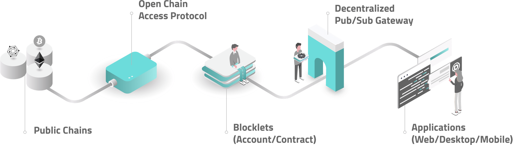
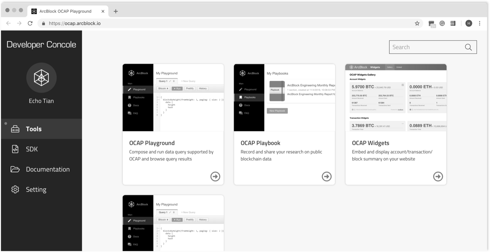

## By Developers, For Developers {.section .section--image-row}

### Welcome home developers

A complete development platform that gives you everything you need up front, and removes the complexity of developing, managing and deploying your DApps in the cloud. Gone are the days of complicated code, hard forks, proprietary systems, and featureless environments. Get everything you need with nothing more than a browser.


## By Developers, For Developers {.section .section--image-row .section--reverse}

### Welcome home developers (Reversed)

A complete development platform that gives you everything you need up front, and removes the complexity of developing, managing and deploying your DApps in the cloud. Gone are the days of complicated code, hard forks, proprietary systems, and featureless environments. Get everything you need with nothing more than a browser.


## Full Stack Platform {.section .section--image-column}

Your entire blockchain development journey - from code to the user experience - is easily managed with ArcBlock’s full stack platform.



## Full Stack Platform (No Description) {.section .section--image-column}


## {.section .section--image-column}


## Awesome OCAP Console {.section .section--image-column}



## Awesome OCAP Console2 {.section .section--feature-list}

#### FLEXIBLE SDKS AND API

Have your choice of SDKs including iOS, Android, Java, and Python with full feature APIs letting you build the way you want without special programming languages make blockchain development easy.

[Explore](https://console.arcblock.co/resources/sdk){.action-button}

#### FLEXIBLE SDKS AND API

Have your choice of SDKs including iOS, Android, Java, and Python with full feature APIs letting you build the way you want without special programming languages make blockchain development easy.

[Explore](https://console.arcblock.co/resources/sdk){.action-button}

#### FLEXIBLE SDKS AND API

Have your choice of SDKs including iOS, Android, Java, and Python with full feature APIs letting you build the way you want without special programming languages make blockchain development easy.

[Explore](https://console.arcblock.co/resources/sdk){.action-button}

#### FLEXIBLE SDKS AND API

Have your choice of SDKs including iOS, Android, Java, and Python with full feature APIs letting you build the way you want without special programming languages make blockchain development easy.

[Explore](https://console.arcblock.co/resources/sdk){.action-button}

## ArcBlock Blockchain **Platform Benefits** {.section .section--card-list}

To help developers, ArcBlock has taken a cloud-agnostic approach and focus on giving developers freedom from infrastructure. We’ve removed the burden of managing and securing applications, setting up nodes and networks. Our goal, make it easy, make it fast and let coders code.

#### FUTURE-PROOF INFRASTRUCTURE

<content-icon name="business-time" color="#4e6af6"></content-icon>

High performance, cloud agnostic and constantly improving. We’ve built our platform on the leading cloud solutions.

#### FRAMEWORK AS A SERVICE

<content-icon name="cogs" color="#4e6af6"></content-icon>

ArcBlock is a unified blockchain framework that allows you to build DApps and blockchain service on a solid and open foundation.

#### ENHANCED SECURITY

<content-icon name="shield-alt" color="#4e6af6"></content-icon>

Build your DApps on our protected cloud and minimize any potential impact on your users and customers.

#### FULLY MANAGED

<content-icon name="window-restore" color="#4e6af6"></content-icon>

Build your Proof of Concept to production without having to worry about capacity, reliability or performance.

#### LOW COST

<content-icon name="piggy-bank" color="#4e6af6"></content-icon>

Focus on your code and lower your costs by avoiding the need to run your own own infrastructure.

#### FLEXIBLE SDKS

<content-icon name="box" color="#4e6af6"></content-icon>

Use your platform of choice, ArcBlock’s includes flexible SDKs including Python, Java, iOS and Android to let you build the way you want.

## Simple Section with list here {.section .section--centered}

- Markdown is awesome
- Markdown pages is even more awesome
- ArcBlock is awesome

## {.section}

!ContactForm[](){formId="929a510f-34f4-4251-98b3-34175200aebd" title="Subscribe to Our Newsletter" button="Subscribe"}

## Markdown Extensions {.section}

### Action Button

```markdown
!ActionButton[Explore OCAP SDK Now](https://console.arcblock.co/resources/sdk)
!ActionButton[Open OCAP Playground](https://ocap.arcblock.io)
```

!ActionButton[Explore OCAP SDK](https://console.arcblock.co/resources/sdk)
!ActionButton[Open OCAP Playground](https://ocap.arcblock.io)

### Content Icon

```markdown
!ContentIcon[box](#4e6af6)
!ContentIcon[box](red)
!ContentIcon[box](green)
```

!ContentIcon[box](#4e6af6)
!ContentIcon[box](red)
!ContentIcon[box](green)

## Custom Components {.section}

### Contact Form

```markdown
!ContactForm[]()
```

Or

```markdown
<contact-form></contact-form>
```

!ContactForm[](){formId="f264a8ef-3354-48f1-9863-42a894602204" title="Learn more about ArcBlock's Partner Ecosystem" button="Contact US" fields="Company,Email,First Name,Last Name" successMessage="Form Submit Success"}

### Shadowed Container (Material-UI Paper)

**Note the blank line after the starting tag and before the closing tag**

```markdown
<mui-paper>

- !ContentIcon[box](#4e6af6)
- !ContentIcon[box](red)
- !ContentIcon[box](green)

</mui-paper>
```

<mui-paper>

- !ContentIcon[box](#4e6af6)
- !ContentIcon[box](red)
- !ContentIcon[box](green)

</mui-paper>

## Page Layouts {.section}

```markdown
<mui-grid-container spacing="40">

<mui-grid-item  xs=12 sm=6>
Left Grid item
!ActionButton[Explore OCAP SDK](https://console.arcblock.co/resources/sdk)
</mui-grid-item>

<mui-grid-item  xs=12 sm=6>
Right Grid item
!ActionButton[Open OCAP Playground](https://ocap.arcblock.io)
</mui-grid-item>

</mui-grid-container>
```

<mui-grid-container spacing="40">

<mui-grid-item  xs=12 sm=6>

Left Grid item
!ActionButton[Explore OCAP SDK](https://console.arcblock.co/resources/sdk)

</mui-grid-item>

<mui-grid-item  xs=12 sm=6>

Right Grid item
!ActionButton[Open OCAP Playground](https://ocap.arcblock.io)

</mui-grid-item>

</mui-grid-container>
