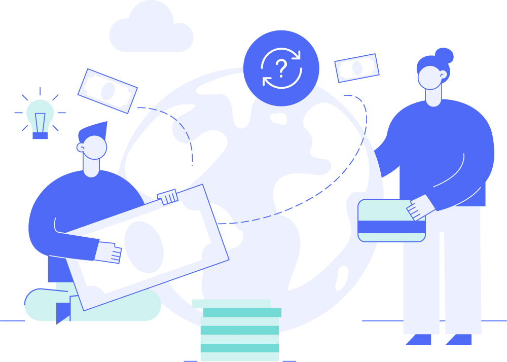
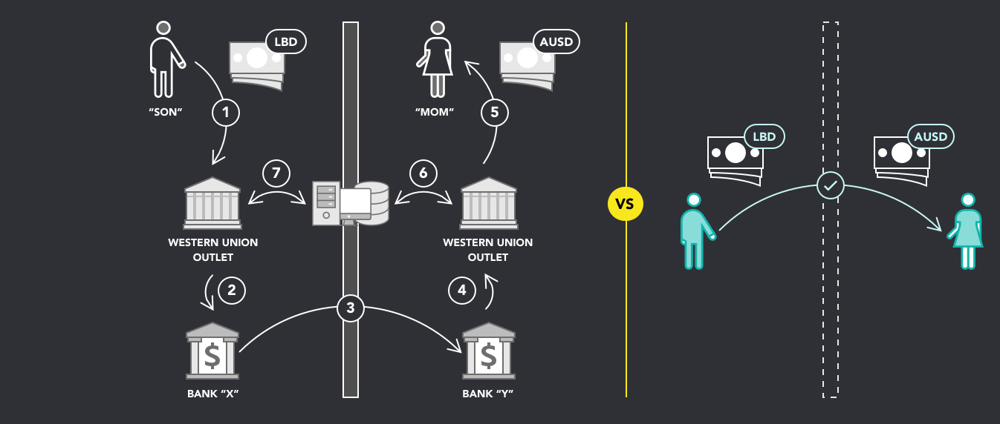
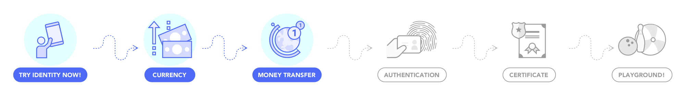
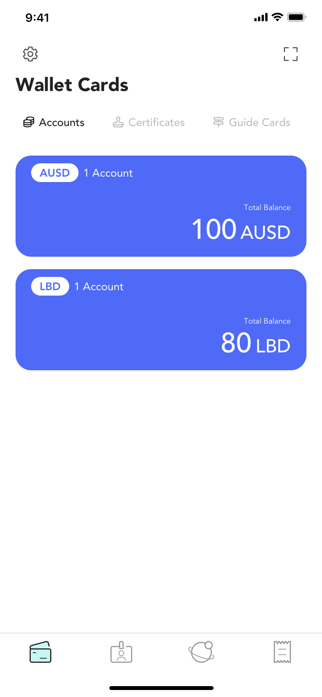
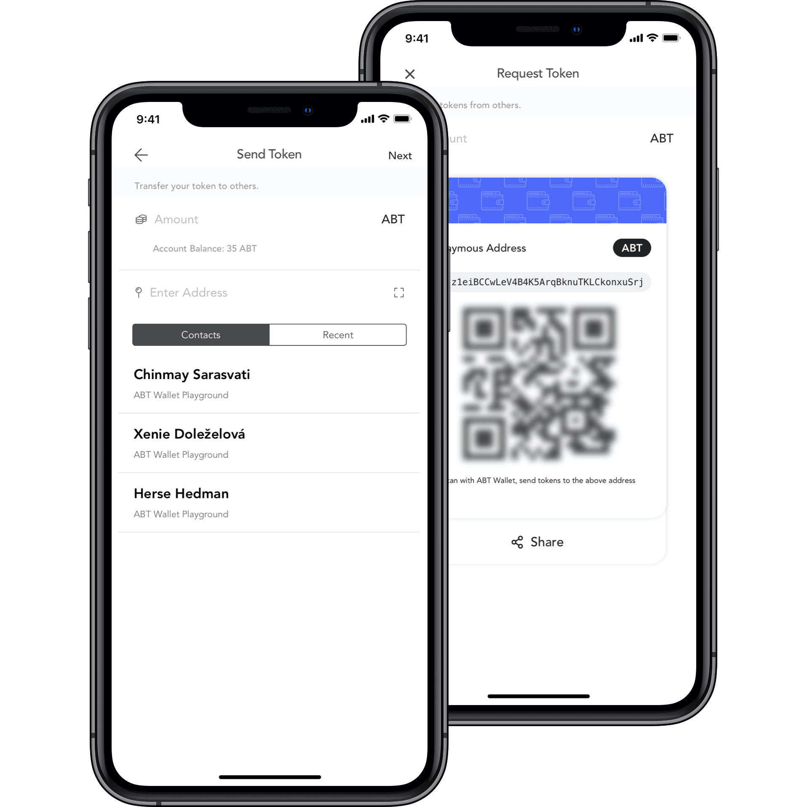
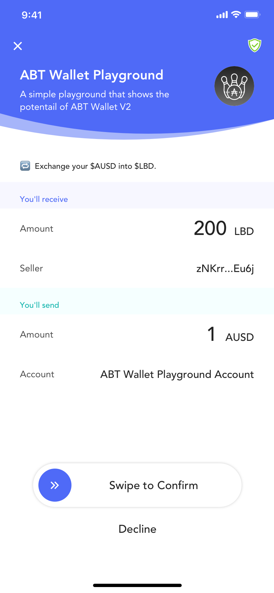
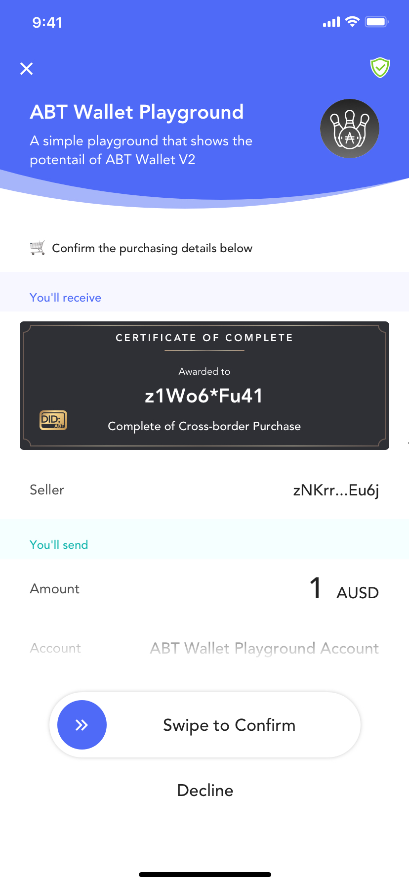
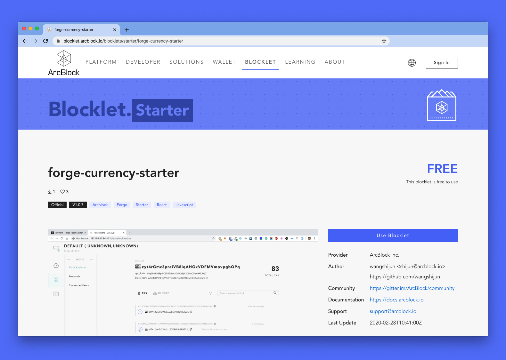

@include ./fragments/shared.md

## Boundaryless Money Transfer {.section .section--image-row-background paddingTop="120px" paddingBottom="260px" bgColor="FAFAFA"}

!Badge[Demonstration App]

🗺 Setup a Foreign Account 
💸 Transfer Money 
🔁 Exchange with Local Currency 
🛒 Make A Purchase Cross Border  

!ActionButton[DOWNLOAD IOS](https://itunes.apple.com/app/id1460083542){icon="fab fa-apple"}
!ActionButton[DOWNLOAD ANDROID](https://play.google.com/store/apps/details?id=com.arcblock.wallet.app.product){icon="fab fa-google-play"}

## Use Decentralized Identity to Manage Money Transfer  {.section .section--image-row columnSize="5:7" .section--centered .section--inverted bgColor="#2F3036"}

Research
 
<b>Western Union</b> vs <b>Money Transfer App</b>
  
To understand the value of a decentralized money transfer app, we need to first understand how a peer to peer transaction compares to sending remittances with Western Union.

## {.section .section--row .section--centered paddingTop="20px" paddingBottom="20px"}

## Setup a Foreign Account {.section .section--image-row columnSize="6:6" .section--centered}

To start, setup and create your first account card and register below. Note, we don't store your data and you confirm everything you share.

!PlaygroundAction[receive_foreign_token]{title="GET 20 AUSD" buttonColor="primary" amount=20}

::: Screenshot {type="iphone-x"}

:::

## Transfer Money {.section .section--image-row columnSize="6:6" .section--centered}

It's also easy to share your currency with someone else locally or even internationally. Using their address, and you can transfer currency instantly.

## Exchange with Local Currency {.section .section--image-row columnSize="6:6" .section--centered}

Use the button below and scan the QR Code to add LBD, confirm the request and verify your deposit. Great work. Those funds are instantly ready in your wallet.

!PlaygroundAction[exchange_to_local_token]{title="1 AUSD → 200 LBD" buttonColor="primary" exchangeRate=200}

::: Screenshot {type="iphone-x"}

:::

## Shopping Cross Border {.section .section--image-row columnSize="6:6" .section--centered}

Now, let's use the button below and scan the QR Code to add LBD, confirm the request and verify your deposit. Great work. Those funds are instantly ready in your wallet.

!PlaygroundAction[buy_local_certificate_with_foreign_token]{title="BUY CERTIFICATE WITH 1 (%token.foreign.symbol%)" buttonColor="primary" price=1 name="Complete of Cross-border Purchase" description="Congrats! You've finished a cross-border purchase on I DID IT"}

::: Screenshot {type="iphone-x"}

:::

## Now, Build It Yourself {.section .section--image-row columnSize="6:6" .section--inverted .section--centered bgColor="#4e6af6"}

In just a few minutes, you can build your own Cash App experience. ArcBlock makes it easy for anyone to develop applications including your own Cash App. The Currency Blocklet is a full-stack javascript DApp template with ArcBlock's SDK fully integrated. Try it now!

!ActionButton[DEPLOY NOW](https://blocklet.arcblock.io/blocklets/starter/xmark-swap-starter){theme="default"}

::: Screenshot {type="surface-book" style="transform-origin: 0 0; transform: scale(1.5); margin-bottom: 40px; margin-top: 40px;"}

:::

## Why Build on ArcBlock {.section .section--inverted .section--image-feature-list bgColor="#2F3036"}

We've built a production-ready platform that includes everything developers need to build, run and use DApps.

!ActionButton[BUILD YOURS NOW](https://blocklet.arcblock.io/blocklets/starter/xmark-swap-starter)
!ActionButton[VISIT FORGE SDK](https://www.arcblock.io/en/forge-sdk)

#### Developer Ready

ArcBlock’s free SDK includes everything you need to build and run your app.

#### Decentralized Identity

W3C compliant [specification](https://arcblock.github.io/abt-did-spec/) and industry leading identity wallet for users.

#### Production Grade

Build for scale, interoperability and security using the [ABT Network](https://www.abtnetwork.io).

## Get Help With Your Project {.section .section--centered}

!ContactForm{formId="f264a8ef-3354-48f1-9863-42a894602204" title=" " button="CONTACT US" fields="Company,Email,First Name,Last Name" successMessage="Thank you for your submission!"}
